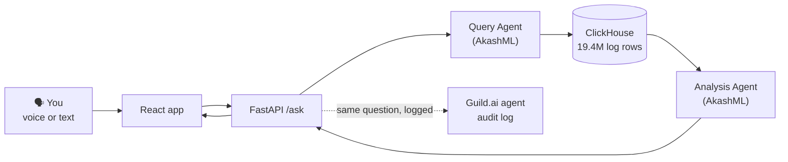

# 🔎 LogWhisperer

**An AI security analyst you can talk to.**

Ask questions about your security logs in plain English, by voice or text, and get a clear answer in seconds: what happened, how risky it is, and what to do next. Every answer shows the exact SQL behind it, so nothing is a black box.

> **You:** "What did computer C17693 do yesterday, in time order?"
>
> **LogWhisperer:** "Yesterday morning, computer C17693 logged into many other computers using at least ten different people's accounts, all within about 90 minutes. One computer using that many different accounts is a strong sign of an attacker moving through the network. This needs urgent investigation."
>
> **Risk:** 🔴 High · **Scanned:** 6.1M rows in 235 ms

Built in one day at the **Cyberdefense Hackathon** (October 9, 2026, San Francisco) for the **Attack Intelligence** track.


---

## 🚨 The problem

Attacks leave clues in logs, but most teams find them too late.

- **Too much data.** A mid-size company produces millions of login events a day. One day of logs in our demo is 19.4 million rows.
- **Hard to ask.** Getting one answer usually needs SQL or a special query language, plus knowing which table holds what.
- **Clues are scattered.** A login, a new computer, and an unusual account can each look harmless alone.
- **Not enough experts.** Small teams rarely have a full-time security analyst, so warning signs go unnoticed.

## 💡 The solution

LogWhisperer works like a security expert sitting next to you: **you ask, it searches, it explains.**

1. **Ask** a question by voice or text.
2. **Query Agent** turns it into one read-only ClickHouse SQL query.
3. **ClickHouse** scans millions of log rows in about a second.
4. **Analysis Agent** looks for attack patterns, rates the risk, and writes a short plain-English answer with next steps.
5. **The app** shows the answer, risk badge, timeline, the SQL used, and query speed, and can read the answer aloud.
6. **Guild.ai** runs the same question as a governed agent, with every step recorded in an audit log you can open.

## 🧭 How it works



## 🏆 Sponsor tools and what each one does

| Sponsor | Role in LogWhisperer |
|---|---|
| **ClickHouse** | Stores 19.4 million real authentication events and answers every query in roughly 0.2 to 2 seconds. The app shows rows scanned and query time with every answer. |
| **Akash (AkashML)** | Runs the open-source **Kimi-K3** model that powers the Query and Analysis agents, through an OpenAI-compatible API. |
| **Guild.ai** | Hosts the LogWhisperer agent. Agents never hold credentials, and every ClickHouse and AkashML call is recorded in a session log linked from each answer. |

## ✨ Features

- 🎙️ **Voice in and out:** push-to-talk questions and a spoken briefing (built into Chrome, no extra keys)
- 🧠 **Plain-English answers** with a **risk badge** (low, medium, high) and up to 3 next steps
- ⚡ **Speed line:** "Scanned 19.4M rows in 1.2 s" on every answer
- 🧾 **Show SQL:** every answer reveals the exact query it ran
- 🕒 **Timeline:** events in time order, with confirmed attack events in red
- 🔗 **Guild audit link:** opens the recorded agent run for the same question
- 🛡️ **Off-topic guard:** unrelated questions get a friendly message instead of a made-up answer
- 🚀 **Caching:** repeated questions return instantly

## 📊 Results

We checked the agents against LANL's official red-team labels. **The agents never see these labels**; they are used only to verify answers afterward and to color confirmed attack events red in the timeline.

| Demo question | Risk | What it found |
|---|---|---|
| "Which accounts logged into the most different computers yesterday?" | Medium | 5 real attacker accounts in the top 10, including U66@DOM1 and U293@DOM1 |
| "What did computer C17693 do yesterday, in time order?" | High | 12 real attacker accounts used from the compromised computer; 25 attack events highlighted |

**Speed:** about 10 seconds for a new question end to end (ClickHouse itself takes about 1 to 2 seconds); repeated questions return in under 0.1 seconds.

The accuracy check is reproducible: `python scripts/check_accuracy.py`

## 🛡️ Safe by design

- **Read-only database user.** The agents connect as a ClickHouse user that can only run `SELECT` on one table.
- **SQL guard.** Every query is checked in code: one statement only, `SELECT` or `WITH` only, with an automatic row limit. A `DROP TABLE` attempt is blocked.
- **Ground truth stays hidden.** The `is_attack` labels are never shown to the agents. Only the accuracy script and the display-only label lookup read them, after the answer is written.
- **Keys stay on the server.** No API key ever reaches the browser. Guild injects credentials server-side, so agent code never holds them.

## 📁 Data

We use one day (day 9) of the **LANL Comprehensive, Multi-Source Cyber-Security Events** dataset: real, anonymized authentication logs from Los Alamos National Laboratory's corporate network, recorded during a red-team exercise.

| | |
|---|---|
| Rows loaded | 19,374,688 authentication events |
| Red-team events that day | 273 (261 matched to auth rows) |
| Attack source computer | C17693 |
| Time handling | LANL times are seconds from the dataset start; we shifted day 9 to 2026-10-08 so questions like "yesterday" read naturally |

Instead of downloading the full 7.6 GB file, `scripts/slice_auth_stream.py` streams it and stops as soon as the chosen day ends.

## 🗂️ Project structure

```
logwhisperer/
├── backend/
│   ├── main.py            # FastAPI app: POST /ask, GET /health, cache
│   ├── db.py              # read-only, SELECT-only ClickHouse helper with stats
│   ├── query_agent.py     # question -> SQL (AkashML)
│   ├── analysis.py        # risk, findings, plain-English answer (AkashML)
│   ├── timeline.py        # rows -> readable timeline events
│   ├── labels.py          # display-only red-team label lookup
│   └── guild_client.py    # starts the Guild run, returns the session link
├── frontend/              # React + Vite app (voice, answer, timeline, Show SQL)
├── guild/                 # Guild agent source and integration specs
├── prompts/               # schema notes, example queries, mock API response
├── scripts/               # LANL download, slicing, labeling, loading, accuracy check
├── .env.example           # every setting the project reads (no secrets)
└── requirements.txt
```

## 🚀 Run it yourself

**Prerequisites:** Python 3.12, Node 18+, a ClickHouse Cloud service, an AkashML API key, and (optionally) a Guild.ai workspace.

**1. Clone and install**
```bash
git clone https://github.com/SreenidhiHayagreevan/logwhisperer.git
cd logwhisperer
python -m venv .venv
source .venv/bin/activate
pip install -r requirements.txt
```

**2. Configure:** copy `.env.example` to `.env` and fill in your keys.
```bash
cp .env.example .env
```

**3. Load the data** (download `redteam.txt.gz` and get the `auth.txt.gz` link from csr.lanl.gov/data/cyber1/)
```bash
python scripts/explore_redteam.py                              # find the busiest attack day
curl -sL "AUTH_LINK" | python scripts/slice_auth_stream.py     # stream only that day
python scripts/label_and_convert.py                            # add labels and timestamps
python scripts/load_clickhouse.py                              # load into ClickHouse
```
Create the `auth_logs` table and the read-only user first (see `scripts/` and `.env.example`).

**4. Start the backend**
```bash
uvicorn backend.main:app --port 8000
```

**5. Start the app** (in a new terminal)
```bash
cd frontend
npm install
npm run dev
```
Open http://localhost:5173 in Chrome.

## 💬 Try asking

- "Which accounts logged into the most different computers yesterday?"
- "What did computer C17693 do yesterday, in time order?"
- "Which computers did U66@DOM1 reach, in order?"
- "Were there logins between midnight and 5 AM?"

## 🔮 Limitations and next steps

- One day of data today; ClickHouse can scale to the full 58-day dataset.
- Some broad questions (for example, "most failed logins") surface noisy automated accounts and can raise false alarms.
- Next: continuous monitoring with Slack alerts, real log sources (Okta, AWS CloudTrail, firewalls) streamed into ClickHouse, and one-click incident reports.

## 👥 Team

- **Sreenidhi Hayagreevan:** data pipeline, ClickHouse, AkashML agents, backend
- **Himaja:** React app, voice, Guild.ai agent, demo materials

## 🙏 Credits

- **Dataset:** A. D. Kent, *Comprehensive, Multi-Source Cyber-Security Events*, Los Alamos National Laboratory, 2015. Released by LANL with copyright waived. Source: csr.lanl.gov/data/cyber1/
- **Sponsors:** ClickHouse, Akash Network (AkashML), Guild.ai
- **Event:** Cyberdefense Hackathon by tokens&, hosted at AWS Builder Loft, San Francisco Tech Week
